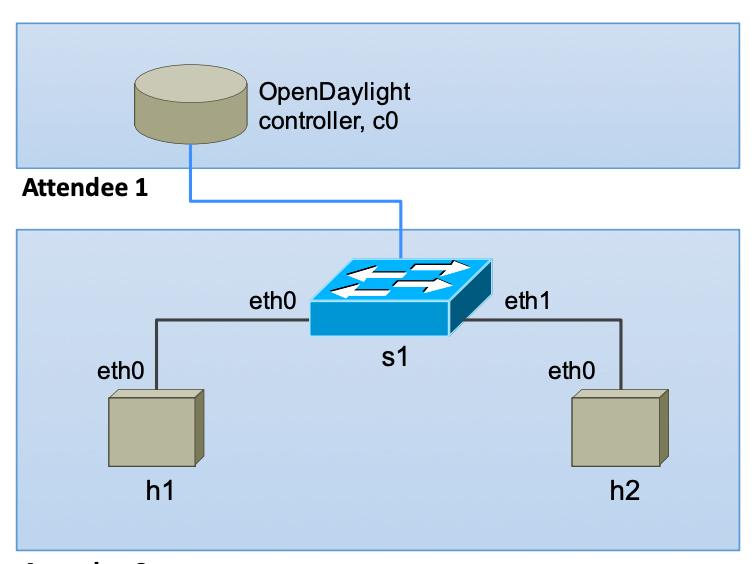

## OpenFlow 实验

本实验来自 https://wiki.apnictraining.net/apnic48-sdn ，感谢 Paresh Khatri 和 Warren Finch 详尽的讲解。

OpenFlow的思路是把data plan（处理数据包转发，由openflow交换机承担）和control plan(控制data plan，由openflow控制器承担)功能分开。

控制器下发flow table规则到OpenFlow交换机，OpenFlow交换机依据规则实现数据包的转发过程。

实验包含3 部分内容，运行在2个虚拟机内：

1. 一个虚拟机名字为mininet，运行 mininet 模拟器，模拟openflow交换机和主机

2. Open Daylight 控制器，运行在一个虚拟机(名字为ODL)内，提供 openflow 控制器功能

3. OpenDaylight-Openflow-App (OFM) 软件，与Open Daylight 控制器运行在同一个虚拟机ODL中，提供OpenFlow 规则的查看等更加人性化功能

如果仅仅为了尝试实验，最简单方法是登录 https://academy.apnic.net ，在 Virtual Labs 中选择 OpenFlow Lab 即可。

这里仅仅给出了使用虚拟机在本地进行实验的步骤。

## 一、准备

虚拟化环境，最简单是安装VirtualBox。

下载2个虚拟机镜像：[mininet-vm.ova](http://ipv6.ustc.edu.cn/ova/mininet-vm.ova) 和 [ubuntu.ova](http://ipv6.ustc.edu.cn/ova/ubuntu.ova)。

## 二、mininet 准备

在VirtualBox中导入 mininet.ova，虚拟机名字默认为mininet，在 MAC 地址处 选择 “为所有网卡重新生成MAC地址”，网卡设置为 与主机网卡 桥接。

启动虚拟机，输入用户名/密码 mininet/mininet，登录后，使用 ping 测试网络通信正常即可(虚拟机自动DHCP获取IP地址)。

在mininet虚拟机中执行命令`ip addr`，显示网卡IP地址为x.x.x.x，从PC终端执行`ssh mininet@x.x.x.x`登录虚拟机，这样做是为了方便后续 copy-paste命令。

在虚拟机中执行命令`sudo mn --test pingall`，如果有如下显示，说明 mininet 工作正常：

```
mininet@mininet-vm:~$ sudo mn --test pingall
*** Creating network
*** Adding controller
*** Adding hosts:
h1 h2 
*** Adding switches:
s1 
*** Adding links:
(h1, s1) (h2, s1) 
*** Configuring hosts
h1 h2 
*** Starting controller
c0 
*** Starting 1 switches
s1 ...
*** Waiting for switches to connect
s1 
*** Ping: testing ping reachability
h1 -> h2 
h2 -> h1 
*** Results: 0% dropped (2/2 received)
*** Stopping 1 controllers
c0 
*** Stopping 2 links
..
*** Stopping 1 switches
s1 
*** Stopping 2 hosts
h1 h2 
*** Done
completed in 2.700 seconds

```

## 三、实验1: 简单的网络拓扑生成

在以上二的基础上，模拟生成如下的简单网络拓扑：


```
1. 创建一个简单的网络拓扑

mininet@mininet-vm:~$ sudo mn --mac --controller="none"

以上命令产生了包含如下内容的模拟网络：
  1 个 交换机, s1
  2 个 主机, h1 and h2
  h1 eth0 连接到 s1 eth0
  h2 eth0 连接到 s1 eth1
  没有 OpenFlow 控制器
 
运行以上命令后，提示符是：
mininet>

2. 执行如下命令了解模拟网络状态：
mininet> nodes
mininet> net
mininet> dump

3. 主机间进行ping测试
mininet> pingll
或者
mininet> h1 ping h2
mininet> h2 ping h1

注意：这里ping是失败的，原因是没有OpenFlow控制器，交换机的默认行为是丢弃所有包。

4. 查看flow table
mininet> dpctl dump-flows

注意：因为没有控制器，flow table为空

5. 退出
mininet> exit
```


## 四、实验2: 简单的网络拓扑，并使用默认的OpenFlow控制器

在以上三的基础上，增加默认的OpenFlow控制器，模拟生成如下的简单网络拓扑：


```
1. 创建一个简单的网络拓扑，使用默认的OpenFlow控制器

mininet@mininet-vm:~$ sudo mn --mac

以上命令产生了包含如下内容的模拟网络：
  1 个 交换机, s1
  2 个 主机, h1 and h2
  h1 eth0 连接到 s1 eth0
  h2 eth0 连接到 s1 eth1
  使用默认的OpenFlow控制器
 
运行以上命令后，提示符是：
mininet>

2. 执行如下命令了解模拟网络状态：
mininet> nodes
mininet> net
mininet> dump

3. 查看flow table
mininet> dpctl dump-flows

4. 主机间进行ping测试
mininet> pingll
或者
mininet> h1 ping h2
mininet> h2 ping h1

5. 查看flow table
mininet> dpctl dump-flows

6. 等一段时间，flow因超时被删除，以下命令输出为空
mininet> dpctl dump-flows

7. 显示OpenFlow交换机和控制器间的通信
mininet> dpctl snoop &

8. h1 ping h2
mininet> h1 ping h2

9. 查看flow table
mininet> dpctl dump-flows

可以重复以上过程，查看流表的变化过程

10. 退出
mininet> exit
```

## 五、Open Daylight虚拟机(ODL)准备

在VirtualBox中导入 ubuntu.ova，虚拟机名字设置为ODL，在 MAC 地址处 选择 “为所有网卡重新生成MAC地址”，网卡设置为 与主机网卡 桥接。

启动虚拟机，输入用户名/密码 apnic/apnic，登录后，使用 ping x.x.x.x 测试与mininet虚拟机网络通信正常即可(虚拟机自动DHCP获取IP地址)。

在ODL虚拟机中执行命令`ip addr`，显示网卡IP地址为y.y.y.y，从PC终端执行`ssh apnic@y.y.y.y`登录虚拟机，这样做是为了方便后续 copy-paste命令。

在ODL虚拟机中按照以下步骤安装相应的软件：

```
1. 更新:
apnic@ubuntu:~$ sudo apt-get update

2. 安装Java 运行环境：
apnic@ubuntu:~$ sudo apt-get install default-jre-headless

设置JAVA_HOME环境变量
apnic@ubuntu:~$ vi ~/.bashrc

增加如下行：
JAVA_HOME=/usr/lib/jvm/default-java

运行文件：
apnic@ubuntu:~$ source ~/.bashrc
```

## 六、安装和配置OpenDaylight控制器软件

在ODL虚拟机中执行如下命令
```
1. 下载并安装OpenDaylight:

Downlight OpenDaylight Boron-SR4 (it may be easier to do a web search for ‘OpenDaylight download’ and then copy the download link from there):

apnic@ubuntu:~$ wget https://nexus.opendaylight.org/content/groups/public/org/opendaylight/integration/distribution-karaf/0.5.4-BoronSR4/distribution-karaf-0.5.4-Boron-SR4.tar.gz

展开压缩文件:
apnic@ubuntu:~$ tar xvf distribution-karaf-0.5.4-BoronSR4.tar.gz

A new directory distribution-karaf-0.5.4-Boron-SR4 will be created in the current directory.
Note that Opendaylight uses Apache Karaf technology (http://karaf.apache.org/) which allows
the entire distribution to be contained in a single folder.

2. 运行 OpenDaylight:
apnic@ubuntu:~$ cd distribution-karaf-0.5.4-Boron-SR4
apnic@ubuntu:~$ ./bin/karaf
The above command will take you to the OpenDaylight shell:
```


```
3. 安装OpenDaylight 特性:

opendaylight-user@root> feature:install odl-restconf odl-l2switch-switch odl-mdsal-apidocs odl-dlux-all

OpenDaylight 特性需要按需启用，安装需要一些时间：
  odl-restconf: Enables the RESTCONF northbound API
  odl-l2switch-switch: Provides an implementation of an Ethernet learning switch
  odl-mdsal-apidocs: Enables access to YANG API
  odl-dlux-all: GUI for OpenDaylight

Verify the installed features:
opendaylight-user@root> feature:list --installed

4. 打开 OpenDaylight GUI界面.

访问 http://y.y.y.y:8181/index.html （y.y.y.y是ODL虚拟机的IP地址）能看到如下的登录界面，使用admin/admin登录。
```


```
5. 如果要退出ODL，可以使用如下命令：
opendaylight-user@root> system:shutdown
```

## 七、实验3: 简单的网络拓扑，使用OpenDaylight控制器

在以上四的基础上，在mininet虚拟机中，改用OpenDaylight控制器，模拟生成如下的简单网络拓扑：



```
1. 启动 Wireshark 抓包软件，选择好网卡，抓取mininet虚拟机的流量

2. Create a display filter within Wireshark for openflow_v4

3. 创建一个简单的网络拓扑，使用OpenDaylight控制器

mininet@mininet-vm:~$ sudo mn --mac --controller=remote,ip=y.y.y.y,port=6633 --switch ovs,protocols=OpenFlow13

其中y.y.y.y是ODL虚拟机IP地址

以上命令产生了包含如下内容的模拟网络：
  1 个 交换机, s1
  2 个 主机, h1 and h2
  h1 eth0 连接到 s1 eth0
  h2 eth0 连接到 s1 eth1
  使用远程的OpenFlow控制器，IP是y.y.y.y
 
运行以上命令后，提示符是：
mininet>

4. 查看flow table
mininet> dpctl dump-flows --protocols=OpenFlow13

注意：如果上述命令错误，请检查 sudo mn ... 命令，特别是最后的protocols=OpenFlow13是否正确

5. 打开OpenDaylight GUI.
浏览器访问 http://y.y.y.y:8181/index.html
单击"reload"可以看到交换机

6. 停止Wireshark抓包，查看mininet和控制器之间的 OpenFlow 通信。特别是 FLOW_MOD 消息与上述4 dump-flow对比。

7. 重新启动 Wireshark 抓包

8. 主机ping测试
mininet> h1 ping h2 -c 4

9. 查看flow table
mininet> dpctl dump-flows --protocols=OpenFlow13

请观察flow table是否有变化。

10. 打开OpenDaylight GUI.
浏览器访问 http://y.y.y.y:8181/index.html
单击"reload"是否有变化

11. 停止Wireshark抓包，查看mininet和控制器之间的 OpenFlow 通信。特别是 Packet-In 和 FLOW_MOD 消息。

12. Exit from the Mininet CLI:
mininet> exit

13. 还可以生成不同的拓扑进行测试，命令行是：
sudo mn --mac --topo=tree,3 --controller=remote,ip=y.y.y.y,port=6633 --switch ovs,protocols=OpenFlow13
sudo mn --mac --topo=linear,4 --controller=remote,ip=y.y.y,port=6633 --switch ovs,protocols=OpenFlow13
```


## 八、OpenDaylight OpenFlow Manager (OFM) 安装、配置和运行

在ODL虚拟机中，按照如下过程安装OFM。
```
1. 安装npm
apnic@ubuntu:~$ sudo apt-get install -y  npm

2. 安装grunt
apnic@ubuntu:~$ sudo npm install -g grunt-cli

3. 创建一个链接，否则会提示node找不到
apnic@ubuntu:~$ sudo ln -s /usr/bin/nodejs /usr/bin/node

4. 下载OFM代码
apnic@ubuntu:~$ cd ~
apnic@ubuntu:~$ git clone https://github.com/CiscoDevNet/OpenDaylight-Openflow-App.git

5. 修改配置
apnic@ubuntu:~$ cd OpenDaylight-Openflow-App/
apnic@ubuntu:~/OpenDaylight-Openflow-App$ vi ofm/src/common/config/env.module.js

将其中 baseURL: "http://localhost:" 中的localhost改为 y.y.y.y，即ODL虚拟机IP地址。
如果修改过OpenDaylight登录名或密码，也请修改。

6. 执行程序
apnic@ubuntu:~/OpenDaylight-Openflow-App$ grunt
Running "connect:def" (connect) task
Waiting forever...
Started connect web server on http://localhost:9000

7. 访问界面
浏览器访问 http://y.y.y.y:9000 就可以看到界面

界面中可以看到交换机、主机等设备，可以对flow table进行修改。
```
